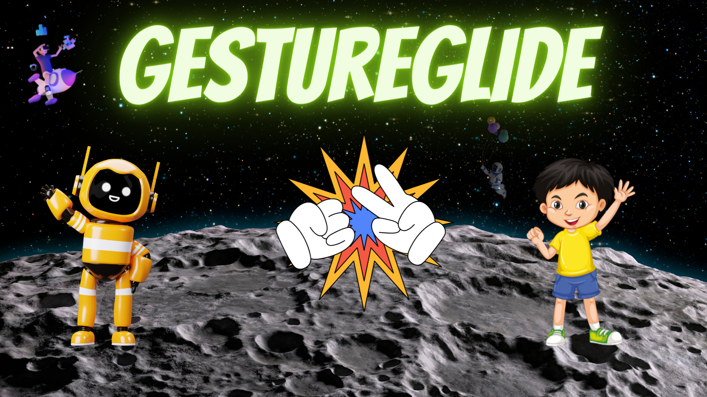
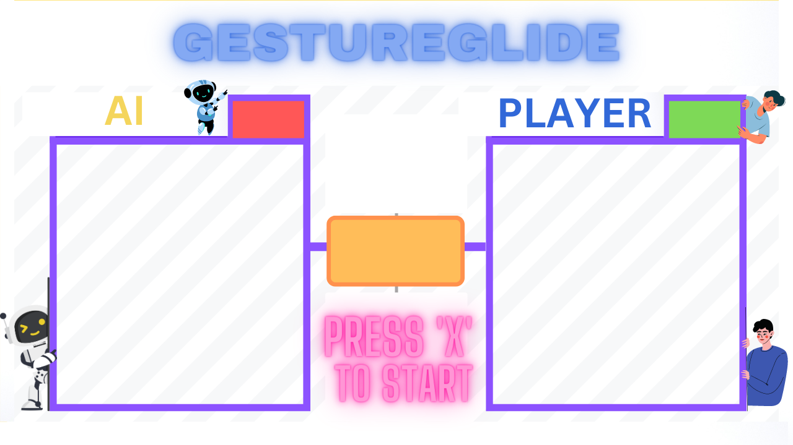

# GestureGlide 🎮👋

Welcome to GestureGlide, an enthralling Rock-Paper-Scissors game meticulously crafted with the power of Python and OpenCV. Step into a realm where AI meets human interaction, utilizing the language of hand gestures to decipher your strategic intent. As you stand across the digital table from your AI adversary, your open hand transforms into the solid symbol of Rock, the airy flutter of Paper, or the decisive form of Scissors. Engage in a symphony of technology and imagination, where your gestures hold the key to victory. Explore the immersive landscape of GestureGlide, where code and creativity collide. 🤖🪨📃✂️

## Features 🎮 
 
- Real-time hand tracking using OpenCV.
- Play against an AI that randomly selects Rock, Paper, or Scissors.
- Interactive timer to track game duration ⏱️.
- Visual representation of your move and AI's move 🤏.
- Keeps track of player and AI scores 📊.

## Installation ⚙️

📌 Clone the repository:

``
   git clone https://github.com/Shubh2-0/gesture-glide.git
   cd gesture-glide
``

📌 Install the required libraries:

``
pip install opencv-python cvzone
``

📌 Place your background image and move images in the resources/ directory.

## Usage 🚀

✴️ Run the game script:
``
python game.py
``
 

✴️  Press the 'x' key to start the game after the webcam feed is displayed.

✴️  Show your hand gesture to select Rock, Paper, or Scissors when the timer reaches 3 seconds.

✴️  The AI will make its move simultaneously, and the winner of the round will be displayed.

## Controls 🎮

🎯 Press 'x': Start the game.

🎯 Gesture your hand to select Rock, Paper, or Scissors.

## Video Presentation 📹
Curious about how GestureGlide works? Watch our detailed video presentation to see the gameplay in action and learn more about the project's features.

📹 [GestureGlide Video Presentation](https://drive.google.com/file/d/13X3C0e1x8AnrUxCu7neQApnYZVWjo7gY/view?usp=sharing)

## Tools Used 🛠️

<table align="center">
  <tr>
    <td align="center" width="170">
      
       Python 
    </td>
    <td align="center" width="170">
      
       PyCharm
    </td>
    <td align="center" width="170">
      
       Github
    </td>
  </tr>
 
</table>

## Contributing 🤝
Contributions are welcome! Here's how you can contribute to this project:

1. Fork the repository.
2. Create a new branch for your feature:  **git checkout -b feature-new-feature** 
3. Commit your changes: **git commit -m 'Add new feature'** 
4. Push to the branch: **git push origin feature-new-feature** 
5. Open a pull request.

## 📬 Contact

If you want to contact me, you can reach me through below handles.

 

  &emsp;
  &emsp;
  &emsp;	
 

 

  <strong>🚀Enjoy the game and have fun playing GestureGlide, where hand gestures pave the way to victory! 🎉👾</strong>

